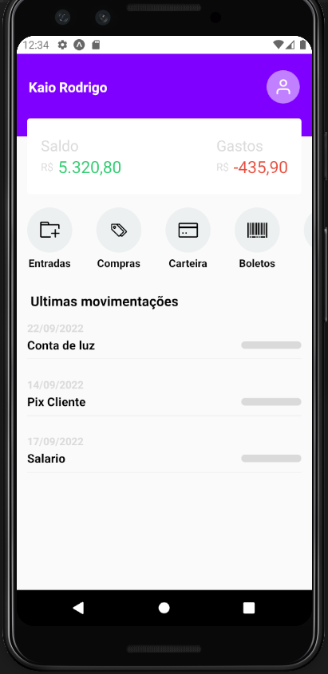

## Rodando Localmente

```sh-session
git clone https://github.com/KaioRodrigoDev/NuClone.git
cd NuClone
```

Instale as dependencias e rode o projeto

```sh-session
npm install
npm run android
```


